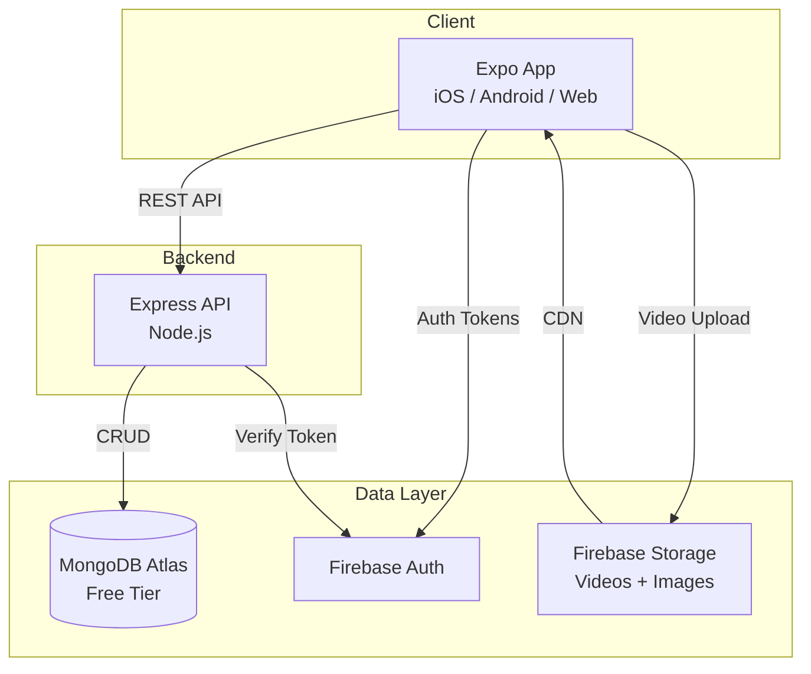
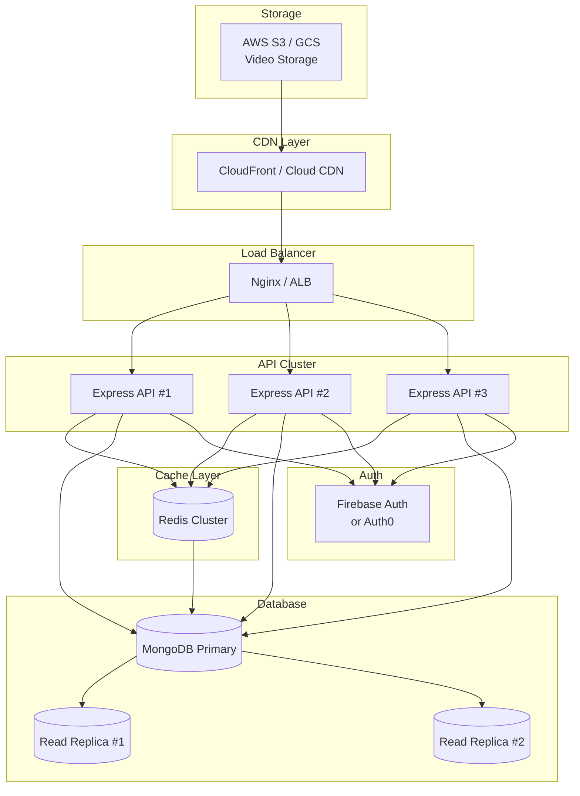
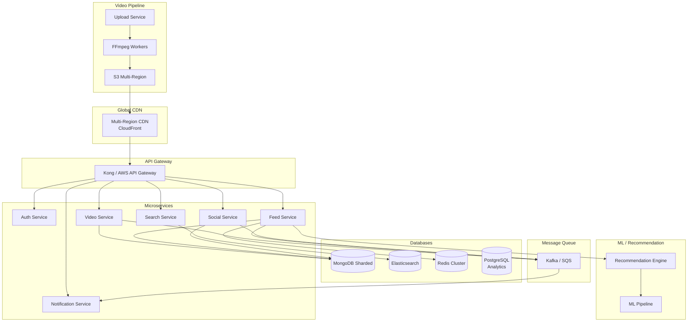

# SkillTok — Scalability Plan

> Architecture evolution from MVP to 1M and 10M users.

---

## Current Architecture (MVP)

### Current Limits (Free Tier)

| Resource | Limit | Supports |
|----------|-------|----------|
| MongoDB Atlas | 512 MB | ~50K videos metadata |
| Firebase Auth | 50K MAU | 50K monthly active users |
| Firebase Storage | 5 GB | ~100 videos (50MB each) |
| Render (backend) | 750 hours/mo | 1 instance, sleeps after inactivity |

---

## 1M Users Architecture

### Key Changes at 1M Users

| Component | Change | Rationale |
|-----------|--------|-----------|
| **Backend** | 3+ API instances behind load balancer | Horizontal scaling |
| **Database** | MongoDB Atlas M10+ with read replicas | Read-heavy workload |
| **Cache** | Redis for feed, user session, popular videos | Reduce DB reads by 80% |
| **Storage** | AWS S3 / GCS with CDN | Scale beyond 5GB, global CDN |
| **Video Delivery** | CloudFront / Cloud CDN | Low latency globally |
| **Search** | Elasticsearch for video search | Full-text, faceted search |
| **Monitoring** | Datadog / New Relic | APM, error tracking |

### Estimated Monthly Cost: $200–500

---

## 10M Users Architecture

### Key Changes at 10M Users

| Component | Change | Rationale |
|-----------|--------|-----------|
| **Architecture** | Microservices (6+ services) | Independent scaling |
| **Database** | MongoDB sharding by region | Data locality |
| **Events** | Kafka for async processing | Decouple services |
| **Video** | Transcoding pipeline (FFmpeg workers) | Multiple resolutions (360p, 720p, 1080p) |
| **Feed** | ML-powered recommendation engine | Personalized content |
| **Notifications** | Push + in-app notifications | Real-time engagement |
| **Search** | Elasticsearch cluster | Advanced search, autocomplete |
| **Analytics** | PostgreSQL data warehouse | Business intelligence |
| **Deployment** | Kubernetes (EKS/GKE) | Container orchestration |

### Estimated Monthly Cost: $5,000–15,000

---

## Migration Roadmap

### Phase 1: 10K → 100K Users
- [ ] Upgrade MongoDB Atlas to M10
- [ ] Add Redis caching for feed and sessions
- [ ] Move videos to S3 with CloudFront CDN
- [ ] Add Sentry for error tracking

### Phase 2: 100K → 1M Users
- [ ] Deploy 3+ API instances behind load balancer
- [ ] Add MongoDB read replicas
- [ ] Implement Elasticsearch for search
- [ ] Add video transcoding (720p + 360p)
- [ ] Set up CI/CD pipeline

### Phase 3: 1M → 10M Users
- [ ] Decompose into microservices
- [ ] Implement Kafka event streaming
- [ ] Build ML recommendation engine
- [ ] Add sharding and multi-region deployment
- [ ] Implement real-time notifications

---

## Monetization Architecture (Future)

### Subscription Tiers

| Tier | Price | Features |
|------|-------|----------|
| **Free** | $0 | Full access to free content |
| **Premium** | $9.99/mo | Premium videos, no ads, certificates |
| **Pro (Teachers)** | $19.99/mo | Analytics, scheduling, live streaming |

### Implementation

- `User.monetizationTier` → `null | 'free' | 'premium' | 'pro'`
- `Video.isPremium` → gates premium-only content
- Payment: Stripe integration via `POST /api/monetization/subscribe`
- Revenue share: 70% teacher / 30% platform
